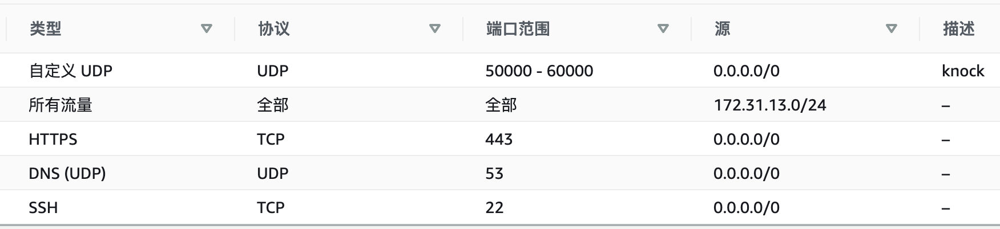

# ServerGuard

# 服务器加固方案（KnockDoor -- 敲门认证）

## 0x00 服务器运维风险

* SSH 等管理端口易受到爆破攻击

* 类似宝塔等基于WEB的远程运维工具存在高危端口，禁用高危端口后功能受限

* 通过防火墙限制来源IP，对动态IP用户不友好

* 安装应用时，情况下默认对公网开放了非必要的可能存在漏洞的端口，增加服务器被攻陷的风险

  

## 0x01 加固方案

* 通过两层外围防护保护主机端口，最大限度收敛攻击面

  * 第一层使用云平台安全组规则，仅放行必须的身份认证(敲门)所用协议和端口，以及ssh等必须对公网开放的端口
  * 第二层使用服务器主机防火墙（如：iptables），默认拒绝不在规则白名单的进站请求

* 使用KnockD作为身份认证服务，监听身份认证（敲门）请求，放行认证通过的来源IP、协议、目的端口

* 可通过SSH远程/本地端口转发访问服务器高危端口，而不对公网开放高危端口（本文未涉及）

  

## 0x02 方案特点

### 优点

* 有效收敛公网暴露攻击面。外部ICMP扫描不能发现主机存活，端口扫描不能发现开放端口
* 有效防护公网端口扫描和爆破攻击
* 配置简单、免维护
* 管理员使用动态IP也可以简便的管理服务器
* 兼容 Docker 业务端口转发

### 缺点

* 敲门身份认证易受到数据包重放攻击，突破对预定义防护端口的访问限制。但利用条件比较苛刻。


## 0x03 拓扑结构

``` shell
User --> VPS Security Group --> syslog ---> Iptables ---> Service(SSH/WEB)
                        		  |          ^
                        		  v          |
                        		  -----> KnockD  
```

1. 使用VPS的安全组规则限制入站流量，仅开放必须的端口。
2. iptables 配置默认禁止进站请求，仅开放白名单中的IP、Port、Protocol


## 0x04 使用演示

* 演示环境
  * Server: AWS EC2 Ubuntu 20.04.3 LTS
  * Client : MacOS

* 服务器端开启/关闭防护

``` shell
# 开启防护（必须以sudo/root权限启动）
sudo ./start-guard.sh

# 
# 停止防护
sudo ./stop-guard.sh
```

* 服务器的Knock日志

``` shell
tail -f /var/log/knockd.log
[2021-12-02 15:16] starting up, listening on ens5
[2021-12-02 15:17] 124.64.x.x: openSSH: Stage 1
[2021-12-02 15:17] 124.64.x.x: openSSH: Stage 2
[2021-12-02 15:17] 124.64.x.x: openSSH: Stage 3
[2021-12-02 15:17] 124.64.x.x: openSSH: Stage 4
[2021-12-02 15:17] 124.64.x.x: openSSH: OPEN SESAME
[2021-12-02 15:17] openSSH: running command: /usr/sbin/iptables -A INPUT -s 124.64.x.x -p tcp -m tcp --dport 22 -j ACCEPT

[2021-12-02 15:18] 124.64.x.x: openSSH: command timeout
[2021-12-02 15:18] openSSH: running command: /usr/sbin/iptables -D INPUT -s 124.64.x.x -p tcp -m tcp --dport 22 -j ACCEPT
```

* 尝试访问服务器

``` shell
# 访问hk的server
./openhk.sh
```

``` shell
openning!
hitting udp 18.162.x.x:50022
hitting udp 18.162.x.x:57000
hitting udp 18.162.x.x:58000
hitting udp 18.162.x.x:56010
You can access the port now!
Welcome to Ubuntu 20.04.3 LTS (GNU/Linux 5.11.0-1021-aws x86_64)

 * Documentation:  https://help.ubuntu.com
 * Management:     https://landscape.canonical.com
 * Support:        https://ubuntu.com/advantage

  System information as of Thu Dec  2 15:17:35 UTC 2021

  System load:  0.0               Processes:                127
  Usage of /:   50.9% of 7.69GB   Users logged in:          1
  Memory usage: 19%               IPv4 address for docker0: 172.17.0.1
  Swap usage:   0%                IPv4 address for ens5:    172.31.38.130

 * Ubuntu Pro delivers the most comprehensive open source security and
   compliance features.

   https://ubuntu.com/aws/pro

1 update can be applied immediately.
1 of these updates is a standard security update.
To see these additional updates run: apt list --upgradable


*** System restart required ***
Last login: Thu Dec  2 15:16:00 2021 from 124.64.x.x
```

------


## 0x05 服务器安装配置KnockD

* 安装KnockD

``` shell
sudo apt install knockd
```

``` shell 
Reading package lists... Done
Building dependency tree
Reading state information... Done
The following NEW packages will be installed:
  knockd
0 upgraded, 1 newly installed, 0 to remove and 0 not upgraded.
Need to get 24.7 kB of archives.
After this operation, 103 kB of additional disk space will be used.
Get:1 http://ap-east-1.ec2.archive.ubuntu.com/ubuntu focal-updates/universe amd64 knockd amd64 0.7-1ubuntu3.20.04.1 [24.7 kB]
Fetched 24.7 kB in 0s (56.9 kB/s)
Selecting previously unselected package knockd.
(Reading database ... 95349 files and directories currently installed.)
Preparing to unpack .../knockd_0.7-1ubuntu3.20.04.1_amd64.deb ...
Unpacking knockd (0.7-1ubuntu3.20.04.1) ...
Setting up knockd (0.7-1ubuntu3.20.04.1) ...
Processing triggers for man-db (2.9.1-1) ...
Processing triggers for systemd (245.4-4ubuntu3.13) ...
```

* 修改配置身份认证序列
``` shell
sudo vi /etc/knockd.conf
```

``` shell
[options]
    LogFile       = /var/log/knockd.log
    # 根据 ifconfig 返回的网卡接口名称填写，默认是eth0
    Interface     = ens5

[opencloseSSH]
    # 端口序列要尽量随机化，不能递增或递减，防止被扫描时碰撞上。
    # 端口可以使用UDP、TCP 或者 UDP+TCP协议
    sequence      = 50022:UDP,59000:UDP,58324:UDP,53333:UDP
    seq_timeout   = 15
    tcpflags      = syn
    start_command = /sbin/iptables -A INPUT -s %IP% -p tcp --dport 22 -j ACCEPT
    cmd_timeout   = 30
    # 在开放防火墙后，等待30秒，若用户端没有动作，则删除该规则
    stop_command  = /sbin/iptables -D INPUT -s %IP% -p tcp --dport 22 -j ACCEPT

```

* 开/关防护脚本

``` shell
vi start-guard.sh
```

``` shell
#!/bin/bash
# 默认禁止进站请求
iptables -P INPUT DROP
# 放行已建立的连接
iptables -I INPUT 1 -m conntrack --ctstate RELATED,ESTABLISHED -j ACCEPT
# 添加一个白名单IP，预防配置错误导致服务器无法连接
iptables -I INPUT 2 -s 白名单IP -j ACCEPT
# 放行DNS回包
iptables -A INPUT -p udp -m udp --dport 53 -j ACCEPT

/etc/init.d/knockd restart
```


``` shell
vi stop-guard.sh
```

``` shell
#!/bin/bash
iptables -P INPUT ACCEPT
iptables -D INPUT -m conntrack --ctstate RELATED,ESTABLISHED -j ACCEPT
iptables -D INPUT -s 白名单IP -j ACCEPT
iptables -D INPUT -p udp -m udp --dport 53 -j ACCEPT

/etc/init.d/knockd stop
```

``` shell
chmod +x start-guard.sh stop-guard.sh
```


## 0x06 配置云VPS安全规则

在云的安全组规则中配置，UDP协议50000-60000端口允许所有来源访问，作为我们的身份认证端口。其他要对外提供服务的端口一并放开。仅在iptables 中对要使用的端口进行访问控制。




## 0x07 客户端安装配置
* 客户端同样需要安装 knock
``` shell
# mac 环境
brew install knock
```

* 编写访问服务器的认证脚本内容

``` shell
vi openhk.sh
chmod +x openhk.sh
```

``` shell
#!/bin/bash

# 申请访问22端口，
# 为保证脚本的复用性，保证端口号是4位，前面用0补足
./open.sh 18.162.x.x 0022
ssh -i ~/.ssh/hk-key.pem ubuntu@18.162.x.x
```

``` shell
vi open.sh
chmod +x open.sh
```

``` shell
#!/bin/bash

usage()
{
    echo "IP and Port are required as the parameter！"
    echo "Usage:${0} 192.168.0.1 0080"
}

open_port()
{
    knock -v -d 100 -u ${1} 5${2} 59000 58324 53333
}

if [ $# -ne 2 ];
then
    usage
    exit
fi

echo "openning!"
open_port $1 $2
echo "You can access the port now!"
```

------


## 特别说明

* 不建议对管理员的来源IP开放全部端口，会失去云平台安全组的第一层防护。
* 通过 SSH 代理访问服务器高危端口，可满足日常运维需求，同时避免高危端口被攻击风险
* 此方案的默认配置不能对Docker 内的业务进行保护。如果需要保护Docker的业务端口，需要修改Knockd.conf 和Start-guard.sh中iptables 相关规则配置，在iptables 的Docker Chain中添加防护规则。关于iptables 相关内容请自行网上搜索。
